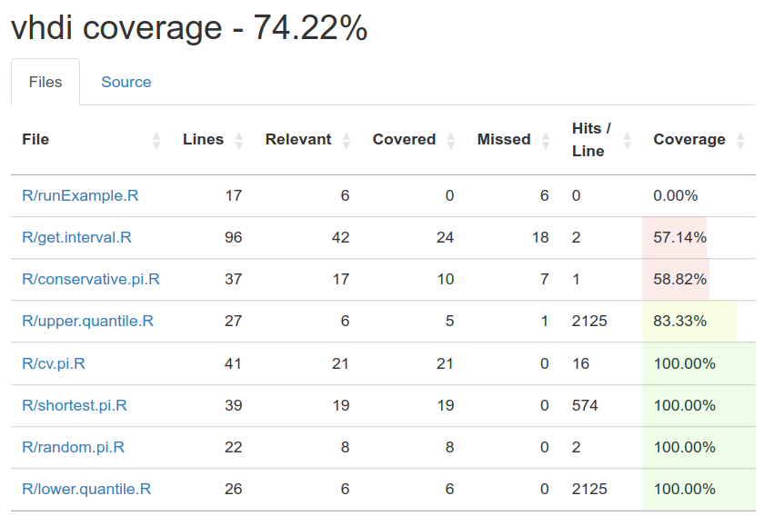

# vhdi

This package allows for the generation of prediction intervals with robust coverage and shortest length. The package contains several functions to compute the prediction intervals from any data set.

For more information, please read:

-   [Frey, J. (2013). Data-driven nonparametric prediction intervals. *Journal of Statistical Planning and Inference*, 143, 1039-1048.](https://doi.org/10.1016/j.jspi.2013.01.004)

## Installation

You can use the ``remotes`` library

    library(remotes)
    remotes::install_github("xyzyc/vhdi")
    library(vhdi)

or you can use the ``devtools`` library

    library(devtools)
    devtools::install_github("xyzyc/vhdi")
    library(vhdi)

## Usage

The three main methods to get prediction intervals are "shortest", "conservative" and "cross validation".

     x <- seq(1:100, by = 0.1)
     alpha <- 0.05
     shortest.pi(x, alpha) # shortest
     conservative.pi(x, alpha) # conservative
     cv.pi(x, alpha, K = 3) # K-fold cross validation

The function ``get.interval`` simulates data from specified distribution, and calculate prediction interval using the specified method.

     get.interval(METHOD = "conservative", DIST = "Gamma", n = 500, alpha)
     
For more detailed description of methodology and functionality, see ``browseVignettes("vhdi")``.

## Unit test: coverage report

We include unit tests for some functions implemented in the package. A coverage report is shown here:

 
